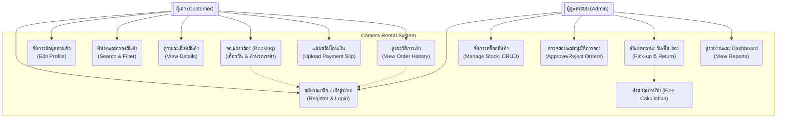

# Camera Rental System (ระบบเช่ากล้อง)
> **Subject:** **CP252 Project**

## Member 

* **1.นาย วัชรพงศ์ มาลัง 67102010174**

* 2.**นาย นราธิป สุวณิชย์ 67102010517**

* 3.**นาย ปกรณ์เกียรติ จิมแสง 67102010520**

## 1. ที่มาของปัญหาและความสำคัญ (Background & Significance)
- ในปัจจุบันคนสมัยใหม่นิยมถ่ายรูปด้วยกล้องดิจิทัล กล้องฟิล์ม และโทรศัพท์มือถือรุ่นเก่า เพื่อให้ได้สไตล์ภาพที่แตกต่าง แต่กล้องหลายรุ่นมีราคาสูงหรือหายาก การเช่ากล้องจึงเป็นทางเลือกที่ได้รับความนิยม อย่างไรก็ตาม ร้านเช่ากล้องหลายแห่งยังมีปัญหาในการจัดการข้อมูลการเช่า–คืนและสถานะอุปกรณ์ จึงจำเป็นต้องมีระบบจัดการที่ช่วยให้การทำงานเป็นระเบียบ สะดวก และลดความผิดพลาดในการให้บริการ
## 2. จุดประสงค์ของ Project (Objectives)
* สร้างระบบเช่ากล้องครบวงจร ตั้งแต่การสมัครสมาชิก ค้นหาสินค้าตามหมวดหมู่ ไปจนถึงการจองออนไลน์ได้ในที่เดียว จัดการสต็อกได้แบบ Real-time ตรวจสอบสถานะอุปกรณ์ได้ทันทีว่าตัวไหนว่าง ถูกเช่า หรือกำลังส่งซ่อม เพื่อให้มีความสะดวก จองง่ายและรองรับมือถือ ออกแบบขั้นตอนการจองให้สั้น กระชับ เพียง 3-4 ขั้นตอน และใช้งานได้ลื่นไหลผ่านมือถือ ระบบคำนวณเงินแม่นยำ คิดค่าเช่าและค่าปรับถ้าหากคืนสายให้โดยอัตโนมัติ ช่วยลดความผิดพลาดในการทำบัญชี สร้างความปลอดภัยที่สูง ปกป้องข้อมูลผู้ใช้ด้วยการเข้ารหัส พร้อมระบบป้องกันการจองซ้อนที่ช่วยให้การจองราบรื่นไม่มีติดขัด สรุปภาพรวมธุรกิจได้เร็ว มีหน้า Dashboard สรุปรายได้และรายการงานรายวัน ช่วยให้วิเคราะห์ทิศทางธุรกิจได้ง่ายขึ้น
## 3. ขอบเขตของ Project (Scope)
### 3.1 กลุ่มผู้ใช้งานเป้าหมาย (Target Users) ระบบแบ่งผู้ใช้งานออกเป็น 2 กลุ่มหลัก
* **ผู้เช่า** : ลูกค้าทั่วไปที่ต้องการเช่ากล้องและอุปกรณ์
* **ผู้ดูแลระบบ** : เจ้าหน้าที่ผู้จัดการคลังสินค้าและดูแลรายการเช่า

### 3.2 ขอบเขตด้านฟังก์ชันการทำงาน (Functional)
#### ส่วนของผู้เช่า (User Side)
* **ระบบสมาชิก**: รองรับการสมัครสมาชิก เข้าสู่ระบบ และแก้ไขข้อมูลส่วนตัวได้
* **การค้นหาสินค้า**: สามารถค้นหากล้องตามชื่อรุ่น/แบรนด์ และกรอง ตามหมวดหมู่สินค้าได้ รวมถึงดูรายละเอียดสเปกและสถานะว่าง/ไม่ว่างของสินค้า
* **การจองเช่า** : ผู้ใช้เลือกช่วงเวลาเช่า โดยระบบจะคำนวณราคารวมอัตโนมัติ และตรวจสอบสต็อกสินค้าแบบ Real-time
* **การชำระเงินและติดตามสถานะ**: รองรับการแนบหลักฐานการโอนเงิน และสามารถดูประวัติการเช่าพร้อมสถานะปัจจุบัน (เช่น รอตรวจสอบ, อนุมัติแล้ว, คืนแล้ว)

#### ส่วนของผู้ดูแลระบบ (Admin Side)
* การจัดการคลังสินค้า : สามารถ เพิ่ม/ลบ/แก้ไข ข้อมูลอุปกรณ์ และกำหนดสถานะอุปกรณ์ได้ (เช่น ส่งซ่อม)
* การจัดการคำสั่งเช่า : ตรวจสอบสลิปโอนเงินเพื่อกด "อนุมัติ" หรือ "ปฏิเสธ" การจอง รวมถึงอัปเดตสถานะการรับของ/คืนของ และระบบคำนวณค่าปรับกรณีคืนล่าช้า 
* รายงานผล : แสดงรายการที่ต้องส่งมอบ/รับคืนในแต่ละวัน และรายงานสรุปรายได้ประจำเดือน

### 3.3 ขอบเขตด้านเทคนิคและประสิทธิภาพ (Non-Functional)
* Platform: พัฒนาเป็น Web Application ที่รองรับการแสดงผลบนมือถือ 
Performance : หน้าเว็บต้องโหลดเสร็จภายใน 3 วินาที และรองรับผู้ใช้งานพร้อมกันได้ไม่ต่ำกว่า 50 Users
Data Integrity : มีระบบป้องกันการจองซ้อน (Double Booking Prevention)
Security : มีการเข้ารหัสรหัสผ่าน (Encryption/Hashing) และรับส่งข้อมูลผ่าน HTTPS โดยจำกัดสิทธิ์ให้เฉพาะ Admin เท่านั้นที่เข้าถึงระบบหลังบ้านได้
### 3.4 เครื่องมือและการพัฒนา (Tools & Methodology)
* ใช้กระบวนการพัฒนาแบบ Agile (Scrum)
Design Tools: Figma, Canva
Development Tools: VS Code, Git, GitHub Projects 

### 4. Requirement
#### Functional Requirements
##### สำหรับผู้เช่า 

* Authentication
ผู้ใช้งานสามารถสมัครสมาชิก โดยใช้อีเมลและเบอร์โทรศัพท์
ผู้ใช้งานสามารถเข้าสู่ระบบ และออกจากระบบ ได้
ผู้ใช้งานสามารถแก้ไขข้อมูลส่วนตัว เช่น ที่อยู่สำหรับการจัดส่ง หรือเบอร์โทรติดต่อ
* Product Catalog
สามารถค้นหากล้อง ตามชื่อรุ่น หรือแบรนด์ได้
สามารถกรอง สินค้าตามหมวดหมู่ได้ เช่น DSLR, Mirrorless, Lens, Action Camera
สามารถดูรายละเอียดสินค้า เช่น สเปก, ราคาเช่าต่อวัน, และสถานะว่าง/ไม่ว่าง
* Booking & Reservation
ผู้ใช้งานสามารถเลือกช่วงเวลาที่ต้องการเช่า 
ระบบต้องคำนวณราคาค่าเช่ารวม  ตามจำนวนวันที่เลือกโดยอัตโนมัติ
ระบบต้องตรวจสอบจำนวนสินค้าใน Stock แบบ Real-time ว่าว่างหรือไม่ในช่วงเวลานั้น
* Order & Payment
ผู้ใช้งานสามารถยืนยันการจองและแนบหลักฐานการโอนเงิน ได้
สามารถดูประวัติการเช่า และสถานะของคำสั่งเช่าปัจจุบันได้ 

##### B. สำหรับผู้ดูแลระบบ (Admin)
* Stock Management
Admin สามารถ เพิ่ม/ลบ/แก้ไข ข้อมูลกล้องและอุปกรณ์ (CRUD Operations) Admin สามารถกำหนดสถานะของอุปกรณ์ได้ 
* Order Management
Admin สามารถตรวจสอบสลิปการโอนเงินและกด อนุมัติ หรือ ปฏิเสธ การจองได้ Admin สามารถอัปเดตสถานะเมื่อมีการรับของและคืนของ  ระบบต้องมีการคำนวณค่าปรับ กรณีคืนล่าช้ากว่ากำหนด 
* Dashboard & Report
แสดงภาพรวมรายการที่ต้องส่งมอบและรับคืนในแต่ละวัน แสดงรายงานสรุปรายได้ ประจำเดือน

#### Non-Functional Requirements

* Performance (ประสิทธิภาพ)
หน้าเว็บไซต์ต้องใช้เวลาโหลด ไม่เกิน 3 วินาที สำหรับการใช้งานอินเทอร์เน็ตความเร็วปกติ 
ระบบต้องรองรับการใช้งานพร้อมกัน ได้อย่างน้อย 50 Users โดยไม่ล่ม
* Reliability & Data Integrity (ความน่าเชื่อถือ)
ระบบต้องมีกลไกป้องกันการจองซ้อน โดยใช้ Transaction Management ในฐานข้อมูล
ข้อมูลสถานะสินค้า ต้องเป็นปัจจุบันเสมอ
* Security (ความปลอดภัย)
รหัสผ่านของผู้ใช้งานต้องถูกเข้ารหัส ก่อนบันทึกลงฐานข้อมูล (เช่นใช้ bcrypt)
การรับส่งข้อมูลต้องผ่านโปรโตคอล HTTPS เพื่อความปลอดภัย
จำกัดสิทธิ์การเข้าถึง ให้เฉพาะ Admin เท่านั้นที่สามารถเข้าถึงหน้าจัดการหลังบ้านได้
* Usability (ความสามารถในการใช้งาน)
* User Interface ต้องรองรับการแสดงผลบนอุปกรณ์มือถือ เนื่องจากกลุ่มเป้าหมายมักใช้สมาร์ตโฟน
ขั้นตอนการจอง ต้องกระชับ ไม่เกิน 3-4 ขั้นตอน เพื่อความสะดวกรวดเร็ว
* Maintainability (ความสามารถในการดูแลรักษา)
* Source Code ต้องมีการเขียน Comment อธิบายการทำงาน และตั้งชื่อตัวแปรที่สื่อความหมาย 
ระบบต้องออกแบบในลักษณะ Modular เพื่อให้ง่ายต่อการเพิ่มฟีเจอร์ใหม่ในอนาคต

### 5. Use Case Diagram

    
#### Core Use Cases
##### ผู้เช่า (Customer/User)
* สมัครสมาชิกและยืนยันตัวตน 
* ค้นหาและดูรายละเอียดสินค้า 
* ทำการจองเช่า 
* แนบสลิปโอนเงิน 
* ดูประวัติการเช่า 

##### ผู้ดูแลระบบ (Admin)
* จัดการสต็อกสินค้า 
* อนุมัติ/ปฏิเสธ คำสั่งเช่า
* ดำเนินการรับ/คืนของ และคำนวณค่าปรับ 
* ดูรายงานสรุปรายได้

### 6. กระบวนการทำงาน (Process, Methods, and Tools)
**เราใช้กระบวนการพัฒนาแบบ Agile (Scrum Framework) แบ่งการทำงานเป็น Sprints**
* Process: Weekly Stand-up meeting, Sprint Planning, Retrospective
* Design Tools: Figma (สำหรับ UI/UX) , Canva
* Development Tools: VS Code, Git
* Project Management: GitHub Projects
* Communication: Discord / line

### 🧩 Class Structure & Responsibilities

#### 1. Class: `CameraInventory` (จัดการคลังสินค้า)
> **👤 ผู้รับผิดชอบ:** นาย วัชรพงศ์ มาลัง
* `findCamerasByBrand(brandName)`
  * **Description:** ค้นหากล้องตามยี่ห้อ (Search Logic)
* `calculateAverageDailyPrice()`
  * **Description:** คำนวณค่าเช่าเฉลี่ยเพื่อวิเคราะห์ราคาตลาด

#### 2. Class: `BookingQueue` (จัดการคิวจอง)
> **👤 ผู้รับผิดชอบ:** นาย นราธิป สุวณิชย์
* `findBookingByCustomerName(name)`
  * **Description:** ค้นหาการจองเพื่อเช็คสถานะ (Search Logic)
* `getHighestValueBooking()`
  * **Description:** หาบิลที่มียอดชำระสูงสุดเพื่อดูแลลูกค้า VIP

#### 3. Class: `UserRegistry` (ทะเบียนสมาชิก)
> **👤 ผู้รับผิดชอบ:** นาย ปกรณ์เกียรติ จิมแสง
* `countUsersByMembership(type)`
  * **Description:** นับจำนวนสมาชิกตามประเภท (Count Logic)
* `findUserWithLeastRentals()`
  * **Description:** หาสมาชิกที่เช่าน้อยสุดเพื่อทำโปรโมชั่นกระตุ้นยอด

### 7. สรุปขั้นตอนการทำ Requirement (Requirement Gathering)
🎥 Interview Video: https://youtu.be/NaG_dEiouVI
