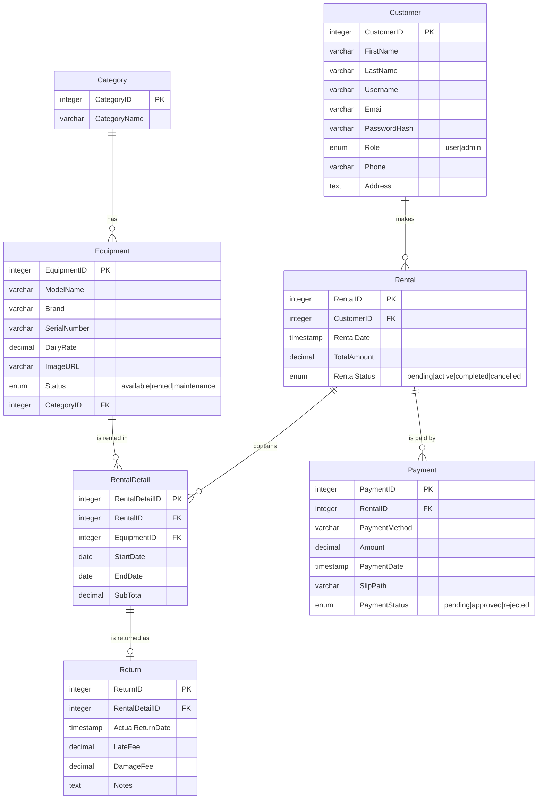
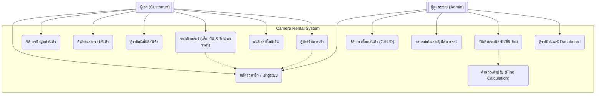

# 📷 Camera Rental System (ระบบเช่ากล้อง)

> **Subject:** CP252 Software Engineering Project — Phase 4 Final

[](https://github.com/naratipswu/cp252project/actions)

---

## 👥 ทีมผู้พัฒนา (Team Members)

| # | ชื่อ | รหัสนักศึกษา | ความรับผิดชอบหลัก |
|:---:|:---|:---:|:---|
| 1 | นาย วัชรพงศ์ มาลัง | 67102010174 | CameraInventory & Search Logic |
| 2 | นาย นราธิป สุวณิชย์ | 67102010517 | BookingQueue & CI/CD Pipeline |
| 3 | นาย ปกรณ์เกียรติ จิมแสง | 67102010520 | UserRegistry & Authentication |

---

## 📋 ภาพรวมโครงการ (Project Overview)

ระบบเช่าอุปกรณ์ถ่ายภาพแบบครบวงจร (Camera Rental Management System) พัฒนาด้วยสถาปัตยกรรม **MVC (Model-View-Controller)** บน Node.js + Express.js ตอบสนองปัญหาจริงของร้านเช่ากล้องที่ยังพึ่งพาการบันทึกด้วยมือ ซึ่งนำไปสู่ข้อผิดพลาดเรื่องการจองซ้อน (Double Booking) และสต็อกไม่ตรงกับความเป็นจริง

### ✨ ฟีเจอร์หลัก

**สำหรับผู้เช่า (Customer)**
- 🔐 สมัครสมาชิกด้วย Email (บังคับ `@gmail.com`) พร้อม Bcrypt Password Hashing
- 🔑 Login ได้ทั้งด้วย Username หรือ Email — หรือผ่าน Mock Google SSO
- 🔎 ค้นหาและกรองอุปกรณ์ตามแบรนด์, รุ่น, หมวดหมู่ (DSLR, Mirrorless, Lens ฯลฯ)
- 📅 เลือกวันเช่า-คืนผ่าน Calendar (Flatpickr) พร้อมคำนวณราคาอัตโนมัติ
- 🛒 ดูตะกร้าสินค้าพร้อมสถานะการจอง (pending → active → completed)
- 💳 แนบสลิปโอนเงินผ่านระบบอัปโหลด

**สำหรับผู้ดูแลระบบ (Admin)**
- 📦 CRUD อุปกรณ์ทั้งหมด พร้อมจัดการสถานะ (available / rented / maintenance)
- ✅ อนุมัติหรือปฎิเสธการจองพร้อมหลักฐานสลิป
- 📊 Dashboard สรุปรายการรับ-คืนประจำวัน
- 🔧 Media Manager สำหรับจัดการภาพอุปกรณ์

---

## 🏗️ สถาปัตยกรรมระบบ (Architecture)

```
cp252project/
├── CameraRentalSystem/         # แอปพลิเคชันหลัก
│   ├── app.js                  # Entry point (Express server)
│   ├── controller/             # Business logic handlers
│   │   ├── authController.js   # Registration, Login, Session
│   │   ├── cameraController.js # Browse, Search, Booking
│   │   ├── cartController.js   # Cart & Order management
│   │   ├── dashboardController.js # Admin dashboard
│   │   └── returnController.js # Return & Late fee logic
│   ├── view/                   # EJS templates (UI)
│   └── public/                 # Static assets (CSS, JS, Images)
├── models/                     # Sequelize ORM Models
│   ├── customer.js             # Customer (User) schema
│   ├── equipment.js            # Camera/Equipment schema
│   ├── rental.js               # Rental header schema
│   ├── rentalDetail.js         # Rental line items
│   ├── payment.js              # Payment & Slip schema
│   └── index.js                # Association definitions
├── config/
│   └── db.js                   # Sequelize DB connection
├── cypress/e2e/                # UI End-to-End Tests
├── tests/                      # Unit Tests (Jest)
├── performance/                # Stress Testing (Autocannon)
├── scripts/                    # Utility scripts (seed data)
└── .github/workflows/          # GitHub Actions CI/CD
```

---

## 🗺️ Database ER Diagram



---

## 🚀 Getting Started

### Prerequisites
- **Node.js** v18+
- **PostgreSQL** v14+ และสร้าง Database ชื่อ `camera_rental`

### 1. ติดตั้ง Dependencies

```bash
npm install
```

### 2. ตั้งค่าไฟล์ `.env`

คัดลอกจาก template แล้วแก้ค่า:

```bash
cp .env.example .env
```

```env
# Database
DB_DIALECT=postgres
DB_HOST=localhost
DB_PORT=5432
DB_NAME=camera_rental
DB_USER=postgres
DB_PASSWORD=YOUR_PASSWORD

# Session
SESSION_SECRET=your-secret-key-here

# Admin account (สร้างอัตโนมัติตอน startup)
ADMIN_USERNAME=admin
ADMIN_EMAIL=admin@example.com
ADMIN_PASSWORD=admin1234

# Optional: เปิดใช้ Mock Google Login (สำหรับ demo เท่านั้น)
ENABLE_MOCK_GOOGLE_LOGIN=true
```

### 3. เริ่มต้นระบบ

```bash
npm start
```

ระบบจะสร้างตารางฐานข้อมูลอัตโนมัติ (Auto Schema Sync) และสร้าง Admin Account ให้ทันที

เปิดเบราว์เซอร์: **http://localhost:3000**

### 4. เติมข้อมูลตัวอย่าง (Optional)

```bash
npm run seed
```

---

## 🧪 การทดสอบ (Testing)

### Unit Tests (Jest) — 19 Tests

```bash
# รัน Unit Tests
npm test

# รัน พร้อมแสดง Coverage Report  
npm run test:cov
```

**ครอบคลุมการทดสอบ:** Auth Logic, Camera Booking, Payment, Promotion, Database Integration

### UI / End-to-End Tests (Cypress) — 5 Test Cases

```bash
# เปิด Cypress Test Runner (Interactive)
npm run cypress

# รันแบบ Headless (CI Mode)
npm run cypress:headless

# รัน Server + UI Tests พร้อมกันอัตโนมัติ
npm run test:ui
```

| Test ID | สิ่งที่ทดสอบ | ผลลัพธ์ |
|:---:|:---|:---:|
| TC001 | Homepage Visibility | ✅ Pass |
| TC002 | User Registration Flow | ✅ Pass |
| TC003 | Search & Filter Logic | ✅ Pass |
| TC004 | Price Display (฿ symbol) | ✅ Pass |
| TC005 | Full Booking Lifecycle (E2E) | ✅ Pass |

### Performance Profiling (Autocannon)

```bash
npm run profile
```

**ผลลัพธ์ล่าสุด (Phase 4):**
- Mean Latency: **0.22 – 7.41 ms**
- Throughput: **123,000+ req/sec**

---

## ⚙️ npm Scripts Reference

| Script | คำอธิบาย |
|:---|:---|
| `npm start` | รัน Express server |
| `npm test` | รัน Unit Tests ทั้งหมด |
| `npm run test:cov` | รัน Tests + สร้าง Coverage Report |
| `npm run lint` | ตรวจสอบ Code Style ด้วย ESLint |
| `npm run lint:fix` | แก้ไข Code Style อัตโนมัติ |
| `npm run cypress` | เปิด Cypress GUI |
| `npm run cypress:headless` | รัน UI Tests ใน Terminal |
| `npm run test:ui` | รัน Server + UI Tests อัตโนมัติ |
| `npm run seed` | เติมข้อมูลตัวอย่างเข้าฐานข้อมูล |
| `npm run profile` | รัน Performance Stress Test |
| `npm run profile:report` | สร้าง Performance Report |

---

## 🔄 CI/CD Pipeline (GitHub Actions)

ทุกครั้งที่ Push โค้ดไปยัง `main` หรือ `develop` ระบบจะรันโดยอัตโนมัติ 7 ขั้นตอน:

```
Push Code
    │
    ▼
[1] 📝 ESLint Code Quality Check
    │
    ▼
[2] ✅ Jest Unit Tests (19 Tests)
    │
    ▼
[3] 🏗️ Build Verification
    │
    ├──────────────────────┐
    ▼                      ▼
[4] 🎬 Cypress E2E      [5] ⚡ Performance
    UI Tests              Profiling
    │                      │
    └──────────┬───────────┘
               ▼
         [6] 🔐 Security Scan
         (npm audit + OWASP)
               │
               ▼
         [7] 🚀 Deploy Ready
```

**ไฟล์ Workflow:**
- `.github/workflows/ci-cd.yml` — Pipeline หลัก (7 jobs)
- `.github/workflows/performance-matrix.yml` — Parallel Performance Tests
- `.github/workflows/test-report.yml` — Test Report Generator

---

## 🧩 Class Structure & Responsibilities

### 1. `CameraInventory` — จัดการคลังสินค้า
> 👤 **นาย วัชรพงศ์ มาลัง**
- `findCamerasByBrand(brandName)` — ค้นหากล้องตามยี่ห้อ
- `calculateAverageDailyPrice()` — คำนวณค่าเช่าเฉลี่ยเพื่อวิเคราะห์ตลาด

### 2. `BookingQueue` — จัดการคิวการจอง
> 👤 **นาย นราธิป สุวณิชย์**
- `findBookingByCustomerName(name)` — ค้นหาการจองจากชื่อลูกค้า
- `getHighestValueBooking()` — หาบิลที่มียอดชำระสูงสุด (VIP Tracking)

### 3. `UserRegistry` — ทะเบียนสมาชิก
> 👤 **นาย ปกรณ์เกียรติ จิมแสง**
- `countUsersByMembership(type)` — นับสมาชิกตามประเภท
- `findUserWithLeastRentals()` — หาสมาชิกที่เช่าน้อยสุดสำหรับทำโปรโมชั่น

---

## 📌 Use Case Diagram



---

## 🔧 Tech Stack

| Layer | Technology |
|:---|:---|
| **Backend** | Node.js, Express.js v5 |
| **Frontend** | EJS (Embedded JS Templates), Vanilla CSS/JS |
| **ORM** | Sequelize v6 |
| **Database** | PostgreSQL 16 (Primary), SQLite (Fallback) |
| **Authentication** | bcryptjs, express-session, CSRF Protection |
| **File Upload** | Multer |
| **Unit Testing** | Jest |
| **UI Testing** | Cypress |
| **Performance** | Autocannon |
| **Linting** | ESLint + eslint-plugin-jsdoc |
| **CI/CD** | GitHub Actions |
| **Design** | Figma, Canva |

---

## 📎 Links

- 🎨 **Figma Design:** https://www.figma.com/proto/YVqTr3EiIpPg1v7y9oaU4G/CP252-Project?node-id=0-1&t=kSAoM3fooFb1x5MB-1
- 🎥 **Interview Video:** https://youtu.be/NaG_dEiouVI
- 🎥 **Retrospective Playlist:** https://youtube.com/playlist?list=PL5leYMm09zHlTQg28mYUbLgPnmWBIGE0n&si=Q-dYDBKXvZ3g3Dzm

---

## 📄 License

Academic project for **CP252 — Software Engineering**, 2024.
