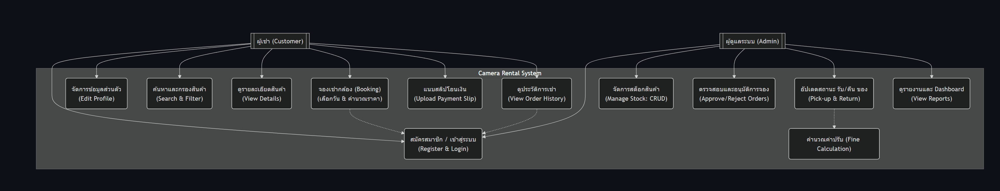

# Project Report: CameraRental (ร้านเช่ากล้อง)

## รายชื่อสมาชิกกลุ่ม
1. **นาย วัชรพงศ์ มาลัง 67102010174**
2. **นาย นราธิป สุวณิชย์ 67102010517**
3. **นาย ปกรณ์เกียรติ จิมแสง 67102010520**
-------------------------------------

## 1. ข้อมูลเดิมจาก Phase 1

**Project Goal:** 
สร้างระบบเช่ากล้องครบวงจร ตั้งแต่การสมัครสมาชิก ค้นหาสินค้าตามหมวดหมู่ ไปจนถึงการจองออนไลน์ได้ในที่เดียว จัดการสต็อกได้แบบ Real-time ตรวจสอบสถานะอุปกรณ์ได้ทันทีว่าตัวไหนว่าง ถูกเช่า หรือกำลังส่งซ่อม เพื่อให้มีความสะดวก จองง่ายและรองรับมือถือ ออกแบบขั้นตอนการจองให้สั้น กระชับ เพียง 3-4 ขั้นตอน และใช้งานได้ลื่นไหลผ่านมือถือ ระบบคำนวณเงินแม่นยำ คิดค่าเช่าและค่าปรับถ้าหากคืนสายให้โดยอัตโนมัติ ช่วยลดความผิดพลาดในการทำบัญชี สร้างความปลอดภัยที่สูง ปกป้องข้อมูลผู้ใช้ด้วยการเข้ารหัส พร้อมระบบป้องกันการจองซ้อนที่ช่วยให้การจองราบรื่นไม่มีติดขัด สรุปภาพรวมธุรกิจได้เร็ว มีหน้า Dashboard สรุปรายได้และรายการงานรายวัน ช่วยให้วิเคราะห์ทิศทางธุรกิจได้ง่ายขึ้น

**Core Features:** 
#### Core Use Cases
##### ผู้เช่า (Customer/User)
* สมัครสมาชิกและยืนยันตัวตน 
* ค้นหาและดูรายละเอียดสินค้า 
* ทำการจองเช่า 
* แนบสลิปโอนเงิน 
* ดูประวัติการเช่า 

##### ผู้ดูแลระบบ (Admin)
* จัดการสต็อกสินค้า 
* อนุมัติ/ปฏิเสธ คำสั่งเช่า
* ดำเนินการรับ/คืนของ และคำนวณค่าปรับ 
* ดูรายงานสรุปรายได้

-------------------------------------

## 2. การเปลี่ยนแปลงความต้องการ (New Requirements)

### Functional Requirements (เพิ่มเติม/แก้ไข)
* [ ] nothing

### Non-functional Requirements (เพิ่มเติม/แก้ไข)
* [ ] nothing

---

## 3. เอกสารการออกแบบ (Design Document)

| หัวข้อ | รายละเอียดเอกสาร |
| :--- | :--- |
| **3.1 Architectural Design** | to be add |
| **3.2 Use Case Diagram** |  |
| **3.3 Database Schema** | to be add |

## 4. การเปลี่ยนแปลงจาก Phase 1 และเหตุผล

| สิ่งที่เปลี่ยน | รายละเอียดการเปลี่ยน | เหตุผลที่เปลี่ยน |
| :--- | :--- | :--- |
| Example **UI Design** | ปรับจากสีฟ้าเป็นสีน้ำเงินเข้ม | เพื่อให้ดูมีความเป็นทางการและน่าเชื่อถือมากขึ้น |
| Example **Database** | เปลี่ยนจาก SQL เป็น NoSQL | เพื่อรองรับข้อมูลที่ไม่มีโครงสร้างแน่นอนในอนาคต |

---

## 5. กระบวนการทำงาน (Process, Methods, and Tools)

### Project Tracking
เราใช้ **GitHub Projects** ในการบริหารจัดการงานตามสถานะ:
* `Todo`: งานที่รอดำเนินการ
* `In Progress`: งานที่กำลังทำ
* `Done`: งานที่ตรวจสอบและเสร็จสิ้นแล้ว

### Workflow & Standards
* **Scrum Frequency:** ประชุม Update งานทุกๆ 1 วันต่อสัปดาห์
* **Git Flow & Branching:**
    * `main`: สำหรับ Production ที่เสถียรแล้วเท่านั้น
    * `develop`: กิ่งหลักสำหรับการรวม Feature ต่างๆ
    * `feat/xxx`: กิ่งแยกสำหรับพัฒนาฟีเจอร์ย่อย
    * `docs/xxx`: กิ่งแยกสำหรับการทำงานเกี่ยวกับ documentation
    * `fix/xxx`: กิ่งแยกสำหรับการแก้ bugs ต่างๆ
* **Commit Message Format:** `[Type]: [Description]`
    * *Example:* `feat: add login logic`, `fix: resolve xxx bug`
* **Communication:** สื่อสารผ่าน **Discord** และมีการบันทึก Summary ทุกครั้ง

---

## 6. สรุปการประชุม Retrospective

### What went well
* อัปเดตความคืบหน้าเรียบร้อย
* แบ่งหน้าที่เพิ่มเติมสำหรับ phase 2

### What could be improved
* ความลื่นไหล
* ความเป็นระบบ

### Action items
* [ ] นำ GitHub Projects มาใช้อย่างเคร่งครัดมากขึ้น ตั้ง Deadline ในแต่ละ Task และ Assign งานให้ชัดเจน

---

## Retrospective Video
* **YouTube link:** [retropective video](https://youtu.be/pDNuwRGK49s?si=MCN7Xc9IYVV-MZtf)
* **หมายเหตุ:** ได้แนะนำตัวสมาชิกที่ช่วงต้นของวิดีโอแล้ว (ชื่อ-นามสกุล + เลขสามตัวท้าย)